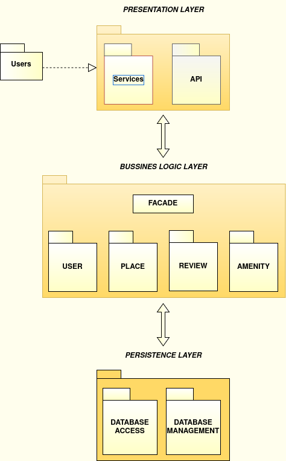
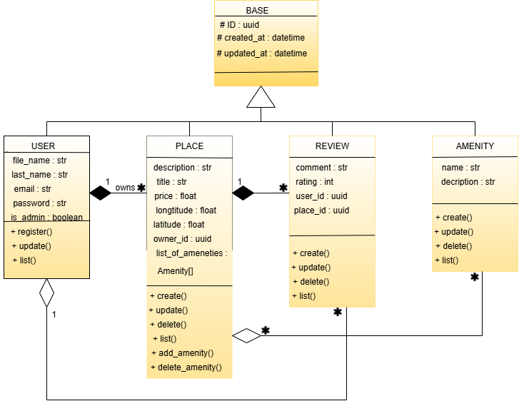
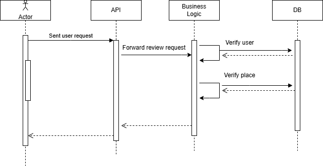
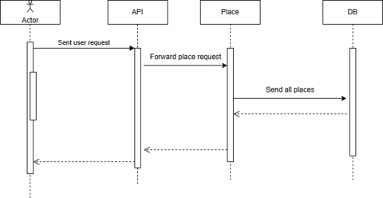
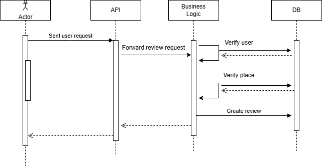

## HBnB Project

### Real-Life Applications
This document also incorporates practical examples to show how users interact with the platform:
- A traveler searching for and booking accommodations.
- A host adding a new rental property and managing its availability.
- Users leaving reviews and ratings after their stay.
- The system processing user authentication and storing booking data securely.

By bringing together detailed explanations, diagrams, and real-world examples, this guide ensures that developers and stakeholders have a clear understanding of how HBnB operates. It will serve as a key reference for ongoing development, future enhancements, and system maintenance.

### Overview
HBnB is a web-based property rental platform that connects users (clients) with hosts (property owners). It is designed with a layered architecture, ensuring easy growth over time and simple updates and fixes.

The platform enables user authentication, property listings, bookings, and reviews through a structured API-driven system.

### Key Features:
- **User Authentication**: Secure sign-up, login, and account management.
- **Property Listings**: Hosts can add, update, and manage rental properties.
- **Booking System**: Users can search, book stays, and receive confirmations.
- **Reviews & Ratings**: Guests can leave feedback and rate their experiences.
- **Structured Data Management**: Using a database and file storage for efficiency.

### System Structure
The system is built in layers to keep things organized and efficient:

- **User Interface (Presentation Layer)**: Where users interact with the platform.
  - *Example*: A traveler searching for vacation rentals on the website.

- **Core Functions (Business Logic Layer)**: Handles how the system works.
  - *Example*: When a user books a stay, the system verifies availability and processes the booking.

- **Data Storage (Persistence Layer)**: Saves information using databases and files.
  - *Example*: Storing user profiles, property listings, and reviews in a database.

A diagram shows how the main parts connect, like the API, database, and controllers.




### Main Components
#### User
The User model stores essential user details such as name, email, and password. It enables authentication and account management, ensuring that only authorized users can book properties or list new ones. Additional attributes may include profile information, past bookings, and preferences.

- *Example*: John Doe creates an account with his email and password to book a stay.

#### Place
The Place model represents rental properties listed by hosts. It includes details such as title, price, location, and property description. This model is crucial for users searching for accommodations, as it provides filtering and sorting options to match user preferences.

- *Example*: A host lists a beachfront apartment for $200 per night.

#### Review
The Review model allows users to leave feedback on their stays, helping future travelers make informed decisions. It typically includes a rating system and a text review. Reviews contribute to platform credibility and encourage hosts to maintain quality service.

- *Example*: A guest leaves a 5-star review for a cozy cabin in the mountains.

#### Amenity
The Amenity model lists additional features available in a property, such as Wi-Fi, swimming pools, or free parking. This model enhances the user experience by providing more details on what a property offers, aiding in decision-making.

- *Example*: A property includes amenities like Wi-Fi, a swimming pool, and free parking.

#### BaseModel
The BaseModel serves as a foundation for all other models, providing shared attributes such as unique ID, creation timestamp, and last update timestamp. It ensures consistency across different components and facilitates data management.

- *Example*: Each new booking or review is automatically assigned a unique ID and timestamp.





# HBnB API Sequence Diagrams

## 1. User Registration

### Description
A user registers for a new account. The request goes through the Presentation Layer (API), which validates the input and sends it to the Business Logic Layer (User Model). If validation passes, the user data is stored in the database.

### Sequence Diagram (Mermaid.js)
```mermaid
sequenceDiagram
    participant User
    participant API
    participant BusinessLogic
    participant Database

    User->>API: POST /register {user data}
    API->>BusinessLogic: Validate user data
    BusinessLogic->>Database: Save user details
    Database-->>BusinessLogic: Confirm save
    BusinessLogic-->>API: Return success response
    API-->>User: Registration successful
    
.png>)

sequenceDiagram
    participant User
    participant API
    participant BusinessLogic
    participant Database

    User->>API: POST /places {place details}
    API->>BusinessLogic: Validate and process request
    BusinessLogic->>Database: Save place details
    Database-->>BusinessLogic: Confirm save
    BusinessLogic-->>API: Return success response
    API-->>User: Place created successfully




# Fetching a List of Places - Sequence Diagram

## Description  
This sequence diagram illustrates the process of retrieving a list of places based on user-defined criteria. The request flows through the Presentation Layer (API), Business Logic Layer, and Persistence Layer (Database) to fetch the relevant data.

## Sequence Flow  
1. **User** sends a `GET /places` request with filtering criteria.  
2. **API** receives the request and forwards it to the **Business Logic Layer**.  
3. **Business Logic Layer** processes the request and queries the **Database** for matching places.  
4. **Database** returns the filtered list of places.  
5. **Business Logic Layer** formats the data and sends it back to the **API**.  
6. **API** returns the list of places to the **User**.  

## Diagram  



sequenceDiagram
    participant User
    participant API
    participant BusinessLogic
    participant Database

    User->>API: GET /users/{id}/reviews
    API->>BusinessLogic: Process request
    BusinessLogic->>Database: Fetch user reviews
    Database-->>BusinessLogic: Return reviews
    BusinessLogic-->>API: Return formatted response
    API-->>User: Display reviews




### How the API Works
The API serves as the communication bridge between the different layers of the HBnB system, ensuring seamless data transfer and interaction. It allows users to perform key actions, such as authentication, property management, booking, and reviewing stays. The API follows RESTful principles, ensuring scalability, maintainability, and efficient interaction between clients and the backend.

#### API Features:
- **User Sign-up and Login**  
  The API provides endpoints for secure user registration and authentication. Passwords are encrypted, and authentication tokens are used to maintain user sessions securely.  
  - *Example*: A user signs up with an email, then logs in to manage bookings.

- **Adding and Managing Properties**  
  Hosts can interact with the API to create, update, and delete property listings. The API ensures validation of required fields, such as title, price, and location, before storing the information in the database.  
  - *Example*: A host adds a new vacation home listing and updates pricing.

- **Booking and Reviewing Places**  
  Users can search for available properties using filters and book their stays. The API ensures that bookings are processed only if the property is available. After a stay, users can submit reviews through the API, which updates the database in real-time.  
  - *Example*: A traveler books a stay, and after their trip, leaves a review.

- **Data Security and Performance Optimization**  
  The API is designed with security in mind, incorporating input validation, rate limiting, and authentication mechanisms to prevent unauthorized access. Additionally, caching mechanisms and optimized database queries enhance performance and minimize latency in data retrieval.

- **Scalability and Future Enhancements**  
  The API follows modular and extensible design principles, allowing easy integration with new features, third-party services, and mobile applications. As the HBnB platform evolves, API endpoints can be updated or extended without disrupting existing functionalities.

### Summary
This document provides an overview of the HBnB project, covering its architecture, key components, and interactions.

HBnB is a web-based property rental platform that connects users looking for accommodations with hosts offering spaces. The system is designed with a layered architecture.

#### Key Aspects Covered in This Document:
- **System Structure**: Describes the three main layers: Presentation (User Interface), Business Logic (Core Functions), and Persistence (Data Storage), explaining how they interact to provide a seamless experience.
- **High-Level System Diagram**: Illustrates the major components such as APIs, databases, and controllers, showing their relationships and data flow.
- **Main Components & Models**: Explains key classes, including User, Place, Review, Amenity, and BaseModel, along with real-world examples of how they are used.
- **API Interaction Flow**: Covers user interactions such as signing up, logging in, booking properties, and leaving reviews, with sequence diagrams that describe data exchanges.
